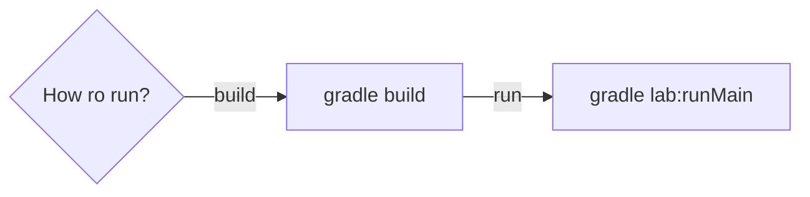

### How to run using IntelliJ IDEA or Another IDE with Gradle and Kotlin Support:
### STUDENT: Mykhailo Chirozidi IM-13
### BOOK OF RECORDS: 1328
1. Clone the project using the following command:
    ```bash
    git clone  https://github.com/michigang1/findjob-service-spring
    ```
2. Open the project in your IDE.
3. **Build the project** using the following command in the terminal:
    ```bash
    gradle build
    ```
4. **Run the project** using the following command in the terminal:
    ```bash
    gradle lab<lab_number>:runMain
    ```

