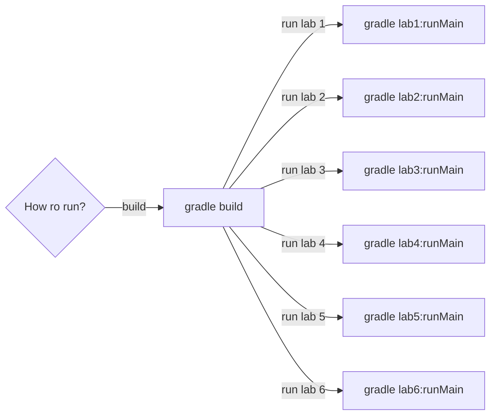

### How to run using IntelliJ IDEA or Another IDE with Gradle and Kotlin Support:
### STUDENT: Mykhailo Chirozidi IM-13
### BOOK OF RECORDS: 1328
1. Clone the project using the following command:
    ```bash
    git clone  https://github.com/michigang1/kotlin-labs.git
    ```
2. Open the project in your IDE.
3. **Build the project** using the following command in the terminal:
    ```bash
    gradle build
    ```
4. **Run the project** using the following command in the terminal:
    ```bash
    gradle lab<lab_number>:runMain
    ```
   
### DESCRIPTION OF THE LABS
* LAB 1:
   - TASK: C2 = 0(+) C3 = 2 C5 = 3(+) C7 = 5(float)
* LAB 2:
   - TASK: C5 = 3 C7 = 5 C11 = 8
* LAB 3:
   - TASK: C3 = 2 C17 = 2
   -  Знайти таке слово в першому реченні заданого тексту, якого не має в жодному з наступних.
* LAB 4:
   - TASK: C11 = 8
   - Cтворити клас Меблі
* LAB 5:
   - C3 = 2 C17 = 2
   - Знайти таке слово в першому реченні заданого тексту, якого не має в жодному з наступних.

